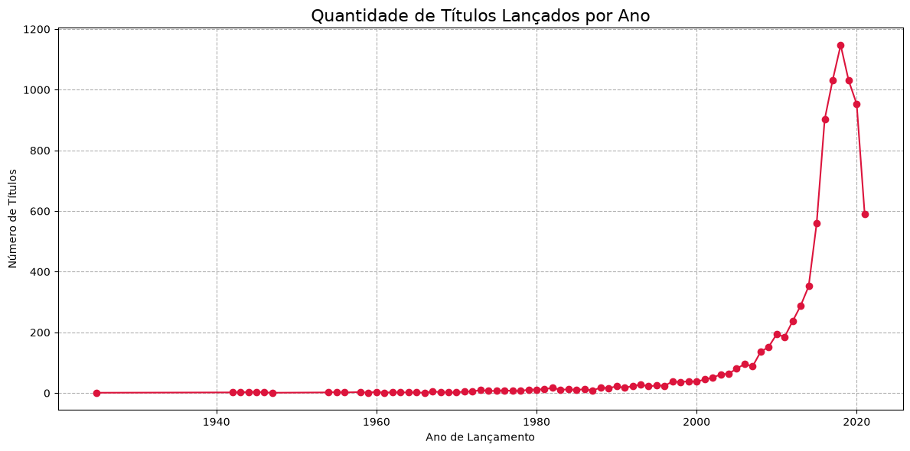
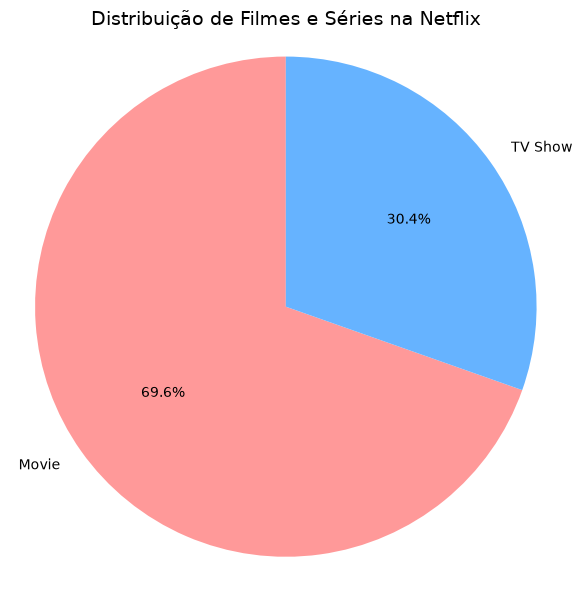

# 🎬 Análise Exploratória do Catálogo da Netflix

> Limpeza, tratamento e análise exploratória de um dataset "sujo" de filmes e séries da Netflix, usando Python, Pandas e Seaborn/Matplotlib.


## 📌 Sobre o projeto

Este projeto realiza uma **análise exploratória de dados (EDA)** sobre o catálogo de títulos da Netflix (filmes e séries). O dataset utilizado (`netflix_titles_sujo.csv`) contém inconsistências propositais, como valores ausentes, linhas duplicadas e tipos de dados incorretos, o que torna o projeto uma boa prática de **limpeza e pré-processamento de dados**, etapa que costuma ocupar a maior parte do tempo em projetos reais de Ciência de Dados.

## 🎯 Objetivos

- Compreender a estrutura e a qualidade dos dados.
- Identificar e tratar valores ausentes, duplicatas e valores discrepantes.
- Corrigir tipos de dados inadequados.
- Extrair insights sobre a evolução do catálogo e a distribuição entre filmes e séries.
- Comunicar os resultados por meio de visualizações.

## 📊 Sobre os dados

| Item | Descrição |
|---|---|
| **Arquivo** | `netflix_titles_sujo.csv` |
| **Registros (bruto)** | 8.812 linhas |
| **Colunas** | 12 |
| **Registros após limpeza** | 8.807 títulos únicos |

**Principais colunas:** `show_id`, `type` (Movie / TV Show), `title`, `director`, `cast`, `country`, `date_added`, `release_year`, `rating`, `duration`, `listed_in` (gêneros) e `description`.

> O dataset é baseado no conjunto público *Netflix Movies and TV Shows* (Kaggle), com problemas de qualidade inseridos para fins de prática.

## 🛠️ Metodologia

### 1. Análise exploratória inicial
- Inspeção geral com `df.info()` e `df.head()`.
- Contagem de valores ausentes por coluna.
- Verificação de linhas duplicadas.
- Estatísticas descritivas das colunas categóricas.

### 2. Limpeza e pré-processamento
| Problema encontrado | Tratamento aplicado |
|---|---|
| `release_year` armazenado como texto | Conversão para numérico (`Int64`) com `pd.to_numeric(errors='coerce')` |
| Valores ausentes em colunas de texto (ex.: `director` com 2.638, `country` com 833 e `cast` com 827 nulos) | Preenchimento com `"Não Informado"` |
| 5 linhas duplicadas | Remoção com `drop_duplicates()` |
| Anos de lançamento fora do esperado (> 2025) | Substituídos por valor nulo |

A limpeza foi feita sobre uma **cópia** do DataFrame (`df_copia`), preservando os dados originais.

### 3. Visualização e análise
- **Gráfico de linha:** quantidade de títulos lançados por ano.
- **Gráfico de pizza:** proporção entre filmes e séries.

## 📈 Resultados

### Títulos lançados por ano


O volume de títulos no catálogo cresce de forma expressiva a partir dos anos 2000, com pico em **2018 (1.147 títulos)**. Os anos seguintes mostram queda, sendo 2021 o menor volume recente (o dado de 2021 provavelmente é parcial, pois o catálogo não cobre o ano completo).

### Filmes vs. Séries


Os **filmes representam cerca de 70%** do catálogo (6.132 filmes contra 2.680 séries na base bruta).

## 🧰 Tecnologias utilizadas

- **Python 3**
- **Pandas** – manipulação e limpeza de dados
- **NumPy** – operações numéricas
- **Matplotlib** e **Seaborn** – visualização de dados
- **Jupyter Notebook** – ambiente de desenvolvimento

## 🚀 Como executar

1. **Clone o repositório**
   ```bash
   git clone https://github.com/SEU-USUARIO/NOME-DO-REPOSITORIO.git
   cd NOME-DO-REPOSITORIO
   ```

2. **(Opcional) Crie um ambiente virtual**
   ```bash
   python -m venv venv
   source venv/bin/activate      # Linux/Mac
   venv\Scripts\activate         # Windows
   ```

3. **Instale as dependências**
   ```bash
   pip install -r requirements.txt
   ```

4. **Abra o notebook**
   ```bash
   jupyter notebook ProjetoFilmes.ipynb
   ```

> ⚠️ Certifique-se de que o arquivo `netflix_titles_sujo.csv` está na mesma pasta do notebook.

## 📁 Estrutura do repositório

```
├── images/
│   ├── grafico_titulos_por_ano.png
│   └── grafico_filmes_series.png
├── netflix_titles_sujo.csv
├── ProjetoFilmes.ipynb
├── requirements.txt
└── README.md
```

## 🔮 Próximos passos

- Explorar os gêneros mais frequentes (`listed_in`) e os países com mais produções.
- Analisar a evolução da data de entrada no catálogo (`date_added`).
- Tratar `duration` separando minutos (filmes) de temporadas (séries).
- Comparar classificações indicativas (`rating`) entre filmes e séries.

## 👤 Autor

**Renan Araujo**

